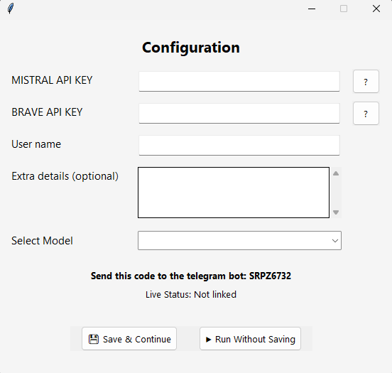
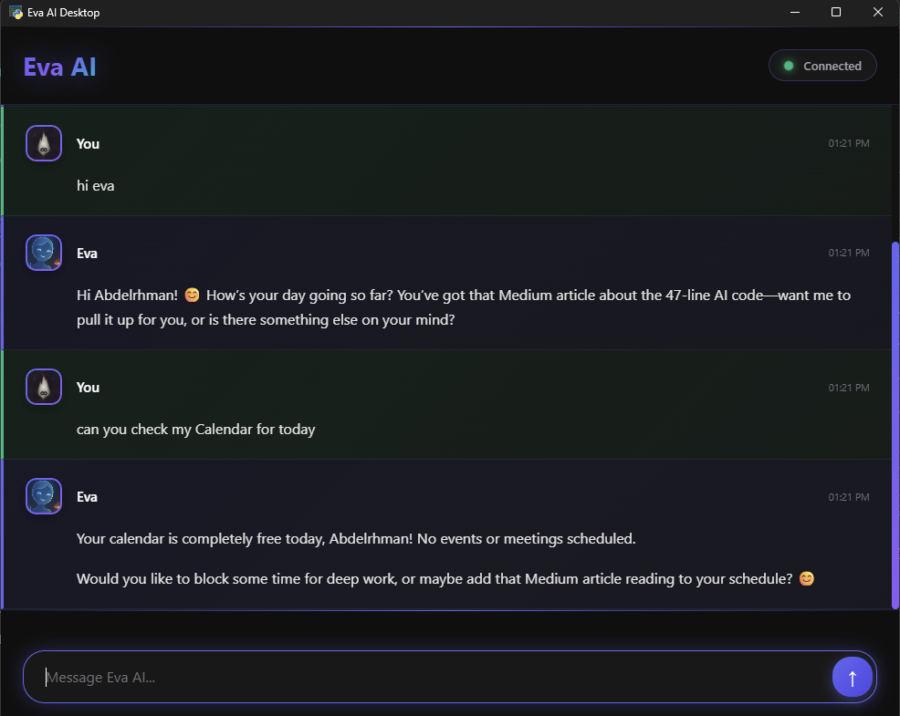

# **Eva AI Desktop Assistant**


# 🌟 Introduction


Eva is an advanced AI-powered desktop assistant that seamlessly integrates artificial intelligence with your daily workflow. Designed to be more than just a chatbot, Eva serves as your personal productivity companion, combining the power of large language models with practical system integration to create a truly intelligent assistant experience.

Built with Python and featuring a modern web interface, Eva connects your local computer environment with cloud services and messaging platforms to provide a unified assistance experience across all your devices. Whether you're managing emails, organizing your schedule, or controlling applications on your computer, Eva brings conversational AI to your desktop with practical, actionable results.

# ⚙ Features

- **Natural Language Processing**: Eva uses the Mestrial API to understand and respond to human language.
- **Task Management**: Create, update, and manage tasks across multiple lists.
- **Calendar Integration**: Schedule and manage events with Google Calendar.
- **Email Management**: Read, send, and manage emails through Gmail.  
- **Web Search**: Get real-time information using Brave Search API.  
- **Telegram Integration**: Receive notifications and interact via Telegram. 
- **Alarm System**: Set one-time or recurring alarms with custom notifications.  
- **Application Control**: Open applications on your computer.  
- **Memory System**: Eva remembers important details about you and your preferences.  


# 🚀 How It Works

## 1. Initial Setup
Eva operates through two distinct interfaces that launch sequentially:


### Stage 1: Configuration Window



When you first run **Eva**, it will guide you through a configuration process:

**API Keys Setup** — You'll need to provide:
- **Mistral API key** (for AI capabilities)
- **Brave Search API key** (for web searches)
- **Your name** for personalized interaction
- *(Optional)* Additional personal details you’d like to share with Eva
- **Model Selection** — Choose from various Mistral AI models based on your needs.

*"How to get your API key" link is provided directly in the configuration window.*

**Telegram Verification**:  
1. Eva generates a verification code.
2. You send this code to the Telegram bot.(https://t.me/Eva_the_chatbot)
3. The bot links your chat ID for future notifications.


---

### **Stage 2: Webview Chat Interface**


After configuration, the application opens a modern webview interface where you can:

- Chat with Eva in real-time
- See your conversation history
- Receive notifications and alerts
- Manage all your tasks through natural language


## 2. Core Architecture
Eva uses a multi-threaded architecture with several integrated services:

```
Main Thread → GUI (Webview)
            → Flask Server (Web Interface)
            → Telegram Bot (Messaging)
            → Email Monitor (Background)
            → Alarm System (Background)
```


## 3. Natural Language Processing

Eva understands commands through structured prompt engineering:

```
<t>Your message to the user</t>
<tool>parameters</tool>
```

Available Tools:

- **<t>text</t>** — Speak to the user
- **<m>memory</m>** — Store important information
- **<s>query</s>** — Web search
- **<o>app_name</o>** — Open application
- **<tg>message</tg>** — Send Telegram message
- **<calendar_update>** — Get upcoming events
- **<ce>event details</ce>** — Create calendar event
- **<ct>task details</ct>** — Create task
- **<sa>alarm details</sa>** — Set alarm
- ...and many more.

## 4. Memory System
Eva uses a JSON-based memory system that:

- Stores important user preferences and details
- Retrieves relevant context from previous conversations
- Uses keyword matching and similarity scoring
- Automatically cleans up old entries to maintain performance

## 5. Google Services Integration
Eva integrates with several Google services through OAuth2:

- Gmail: Read unread emails, send messages, mark as read
- Google Calendar: View upcoming events, create new events
- Google Tasks: Manage tasks across multiple lists

## 6. Alarm System
The advanced alarm system supports:

- One-time alarms
- Recurring alarms (daily, weekly, weekdays, weekends)
- Custom descriptions and notifications
- Background monitoring with thread management

## 7. Telegram Integration
Receive messages from Telegram in real-time

- Send proactive notifications
- Cross-platform messaging support
- Secure chat ID verification


## Requirements
- Python **3.11+** (tested on Python 3.13.7)
- All dependencies are listed in the `requirements.txt` file.  
  Install them using:
```bash
pip install -r requirements.txt
```

## ⬇️ Installation & Setup

You can run Eva in two ways:

### 1. From Source (Python)
1. Install **Python 3.11+** (tested on 3.13.7).
2. Download the source code from this repository.
```bash
git clone https://github.com/Astro-5444/Eva.git
```
3. Install dependencies:
```bash
cd Eva
pip install -r requirements.txt
```
4. Run:
```bash
python main.py
```
### 2. Using the Executable
1. Go to the [Releases](https://github.com/Astro-5444/Eva/releases) page.

2. Download the .rar file containing Eva.exe.

3. Extract the .rar file.

4. Run Eva.exe — no Python installation needed.


# 🔜 Planned Features

Eva will be enhanced with the following capabilities in future releases:

- **Voice Interaction** – Talk to Eva using natural speech and receive spoken responses, making the assistant hands-free.

- **Weather API Integration** – Get real-time weather updates and forecasts directly from the chat interface.

- **Spotify API Integration** – Control your Spotify account through Eva, including playing songs, controlling volume, and managing playlists.

# 📄 License


Eva AI Desktop Assistant is released under a custom license. See the LICENSE file for full details.

**Permissions:**
- Personal use
- Commercial use (with credit to the original author)
- Installation and usage without modification

**Conditions:**
- Proper credit must be given to the original author: **Abdelrhman Hazem Khalil**
- The software must **not** be modified, altered, reverse-engineered, or adapted
- The software must **not** be redistributed under another name or misrepresented as your own work

**Limitations:**
- Provided “AS IS” without any warranty
- No liability for any damages arising from use of the software

For complete license terms, please refer to the [LICENSE](LICENSE) file in the project repository.


# 🛠 Support & Issues

If you encounter any bugs, errors, or unexpected behavior while using Eva, please report them by opening an [issue on GitHub](https://github.com/Astro-5444/Eva/issues).  

This helps keep all reports organized and ensures transparency for other users.
